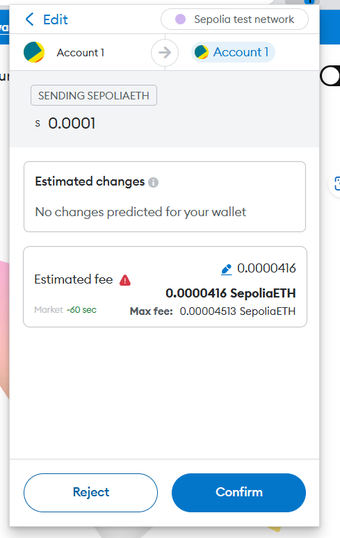
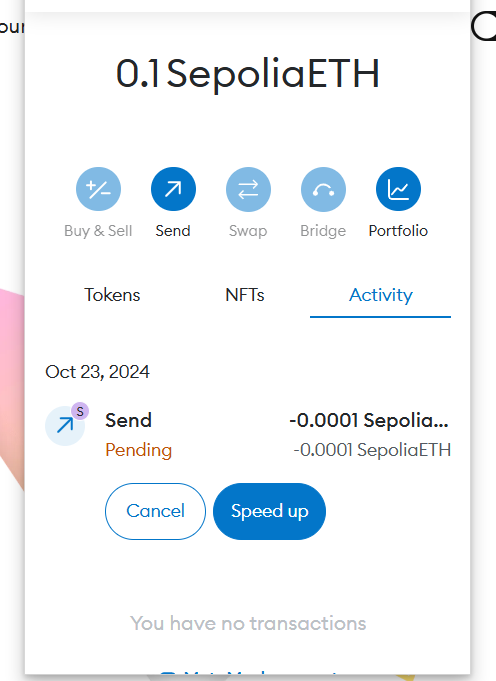

### Steps

1. Install MetaMask browser extension (https://metamask.io/)
2. Create a new account (follow the steps)
3. Choose a test network (Sepolia)

4. Head to https://faucets.chain.link/sepolia to get some test tokens (A Sepolia Faucet)

5. Sign-in with GitHub and transfer the tokens. Once completed, the tokens are visible in MetaMask. Click 'Send' and enter your own address (to make a test transaction)

6. The transaction should be now visible in MetaMask

7. Once the transaction is confirmed, the details must be visible.

