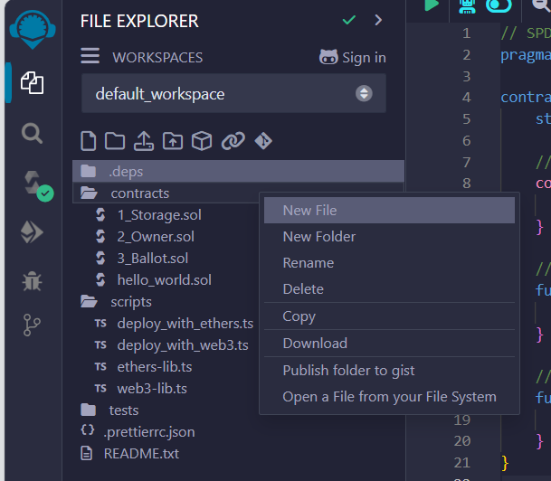
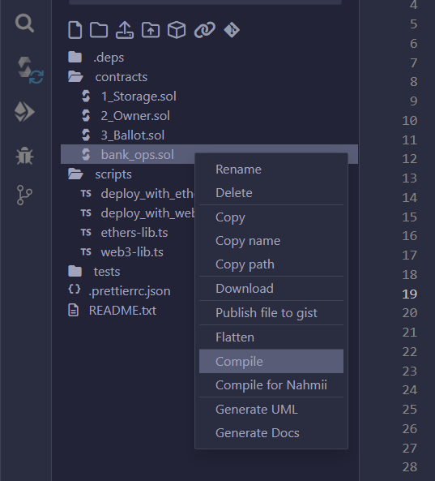
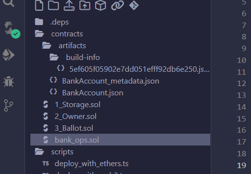
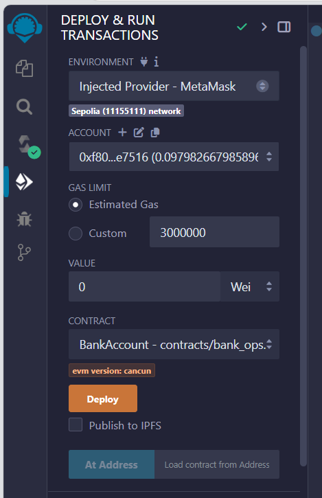
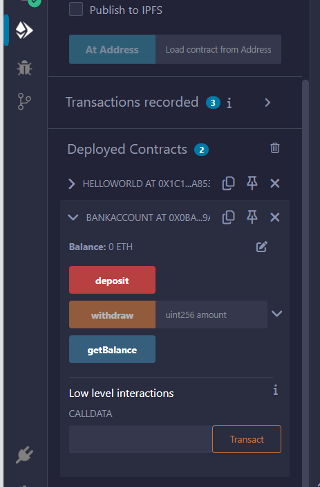

### Steps

> [!INFO]
> Running code for this assignment requires MetaMask installed with some test ETH available in the wallet to execute the smart contract. Make sure you complete [BT_01](https://github.com/shubham0204/PICT_Coursework/tree/lp-3/BT_01).

1. Head to https://remix.ethereum.org/ (online editor for Solidity)

2. Create a new file in the `contracts` directory in the 'File explorer' tab. Name this new file `bank_ops.sol`:



3. Click on `bank_ops.sol` and paste the following contents,

```solidity
// SPDX-License-Identifier: MIT
pragma solidity ^0.8.0;

contract BankAccount {
    // State variable to keep track of the customer's balance
    uint256 private balance;

    // Event to log deposits and withdrawals
    event Deposit(uint256 amount);
    event Withdraw(uint256 amount);

    // Constructor to initialize the balance to zero upon deployment
    constructor() {
        balance = 0;
    }

    // Function to deposit money into the account
    function deposit() public payable {
        balance += msg.value; // Update balance with the sent amount
        emit Deposit(msg.value); // Emit deposit event
    }

    // Function to withdraw money from the account
    function withdraw(uint256 amount) public {
        require(amount <= balance, "Insufficient balance"); // Check for sufficient balance
        balance -= amount; // Deduct amount from balance
        payable(msg.sender).transfer(amount); // Send amount to the caller
        emit Withdraw(amount); // Emit withdrawal event
    }

    // Function to check the current balance
    function getBalance() public view returns (uint256) {
        return balance;
    }
}
```

4. Right click on `bank_ops.sol` and click `Compile`:



5. Once compiled, an `artifacts` directory should be created inside the `contracts` directory:



6. Go to the `Deploy and run transactions` tab, select `Injected Provider - MetaMask` as the environment. MetaMask will ask for confirmation to connect with remix.ethereum.org. Click `Deploy` and `Confirm` on the MetaMask popup:



7. The new contract is visible in the `Deployed Contracts`. Click on the names of the methods to execute them. MetaMask will popup to show the ETH being used for each transaction:

